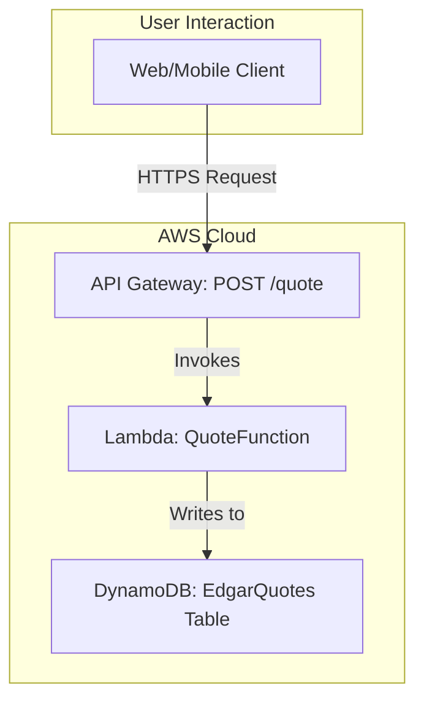

# README - Edgar's Mobile Auto Repair Hub

This repository contains the serverless backend for "Edgar's Mobile Auto Repair Hub," a conversational AI system for generating service quotes. The project is built entirely on AWS and managed via Terraform, demonstrating modern cloud architecture and DevOps practices.

## Core Technologies

-   **Cloud Provider:** AWS
-   **Compute:** AWS Lambda (Python)
-   **API:** Amazon API Gateway (HTTP API)
-   **Database:** Amazon DynamoDB
-   **Conversational AI:** Amazon Lex (planned integration)
-   **Infrastructure as Code:** Terraform
-   **CI/CD:** GitHub Actions

---

## Architecture

The system is designed as a serverless, event-driven architecture. The initial implementation provides a core RESTful API for quote generation.

## Project Status

The project has evolved significantly from its original quote generation focus to become a comprehensive mobile auto repair booking platform with:

- **Frontend**: React/TypeScript with Tailwind CSS
- **Backend**: Python Flask with PostgreSQL
- **SMS System**: Automated appointment reminders
- **Admin Dashboard**: Real-time appointment management
- **Production Ready**: TCPA-compliant SMS system

## Recent Updates

- SMS compliance system implemented (TCPA-compliant)
- 24-hour appointment reminder automation
- Frontend optimization (15% bundle size reduction)
- Production monitoring and alerting
- Complete E2E testing framework

## Getting Started

See the individual project documentation in the `memory-bank/` directory for detailed setup and deployment instructions.
